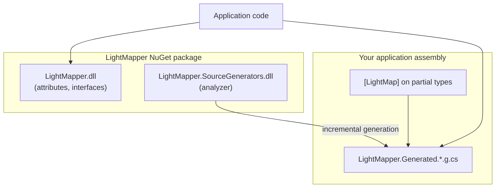
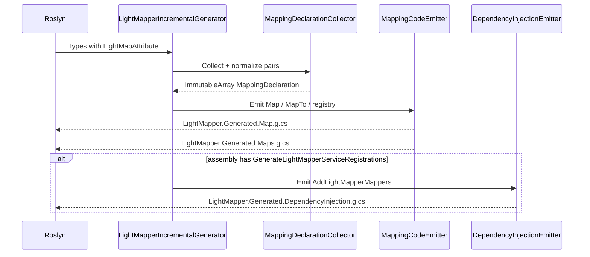
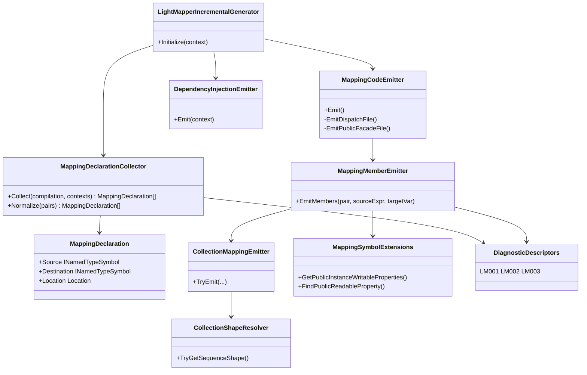

# LightMapper programming guide

This guide explains how to use LightMapper effectively while keeping mappings fast and maintainable.

## Concepts

LightMapper generates **per-pair mapping methods** at compile time. You declare pairs with attributes; the source generator emits:

- `LightMapper.Generated.Maps` — public `Map` / `MapTo` entry points
- `LightMapper.Generated.LightMapDispatch` — internal implementations and `ILightMapper<,>` singletons
- Optional `AddLightMapperMappers()` when you opt in with `[assembly: GenerateLightMapperServiceRegistrations]`

Mappings are **assembly-local**: source and destination types must live in the project where the generator runs.

## Step-by-step setup

### 1. Declare a mapping pair

Place `[LightMap]` on the **source** type (the type you map *from*):

```csharp
[LightMap(typeof(OrderDto), Bidirectional = true)]
public sealed partial class Order
{
    public Guid Id { get; set; }
    public string Reference { get; set; } = "";
}
```

`Bidirectional = true` also generates `OrderDto` → `Order`.

Both types must be `partial` (even if you never add a manual partial body). This leaves room for customization hooks.

### 2. Map to a new instance

```csharp
using LightMapper.Generated;

OrderDto dto = Maps.Map<Order, OrderDto>(order);
```

Under the hood this calls generated code with **no reflection**. For unknown type pairs at compile time, `LightMapperException` is thrown.

### 3. Map into an existing instance (`MapTo`)

Use when you reuse DTOs (object pools, buffers, or updating UI models):

```csharp
var dto = new OrderDto();
Maps.MapTo(order, dto);
```

`MapTo` assigns matching members on the existing `dto` instance. It does not clear unrelated properties; only declared destination members are written.

### 4. Rename members

When names differ, annotate the **destination** property:

```csharp
public sealed partial class OrderDto
{
    [LightMapFrom("Lines")]
    public List<OrderLineDto> OrderLines { get; set; } = new();
}
```

### 5. Ignore members

Skip sensitive or server-only fields on the destination:

```csharp
[LightMapIgnore]
public Guid InternalId { get; set; }
```

### 6. Nested objects and collections

Register a `[LightMap]` pair for each nested type. LightMapper will call the nested `Map_*` methods automatically.

Supported collection shapes:

| Source | Destination |
|--------|-------------|
| `T[]`, `List<T>`, `IReadOnlyList<T>`, `ICollection<T>`, `IEnumerable<T>` | `List<TDest>`, `TDest[]`, `IReadOnlyList<TDest>`, `HashSet<TDest>` |

Element types must be identical or have their own `[LightMap]` pair.

### 7. Customize after automatic mapping

Implement `ILightMapperAfterMap<TDestination>` on the **source** type:

```csharp
[LightMap(typeof(OrderDto))]
public sealed partial class Order : ILightMapperAfterMap<OrderDto>
{
    public decimal Total { get; set; }

    public void AfterMap(OrderDto destination)
    {
        destination.DisplayTotal = Total.ToString("C");
    }
}
```

Generated code maps members first, then calls `AfterMap` when the source implements the interface. This follows the **open/closed** idea: extend behavior without changing the generator.

### 8. Dependency injection

In `AssemblyInfo.cs` (or any file):

```csharp
using LightMapper.DependencyInjection;

[assembly: GenerateLightMapperServiceRegistrations]
```

Register services:

```csharp
services.AddLightMapperMappers();

var mapper = sp.GetRequiredService<ILightMapper<Order, OrderDto>>();
var dto = mapper.Map(order);
mapper.MapTo(order, existingDto);
```

`ILightMapper<TSource, TDestination>` is a singleton with no per-call allocation.

## Choosing an API

| Scenario | Recommended API |
|----------|-----------------|
| One-off mapping in application code | `Maps.Map<,>` |
| Hot path with known types | Generated `LightMapDispatch.Map_*` (fastest; same assembly only) |
| Reused destination instance | `Maps.MapTo<,>` or `ILightMapper<,>.MapTo` |
| Constructor injection | `ILightMapper<,>` via DI |

Generic `Maps.Map<TSource, TDestination>` uses a small chain of `typeof` comparisons. This is ideal for dozens of pairs; for very large tables in tight loops, call the specific generated method instead.

## Internal architecture and class design

This section describes how LightMapper is structured in the repository, what runs at compile time versus runtime, and how the source generator turns `[LightMap]` declarations into C# mapping code. It is aimed at contributors and advanced users who need to reason about performance, diagnostics, or future extensions.

### Solution layout

LightMapper splits responsibilities across two deliverables:

| Project | Role | Ships to consumers |
|---------|------|-------------------|
| **`LightMapper`** | Small runtime library: attributes, `ILightMapper<,>`, `ILightMapperAfterMap<>`, `LightMapperException`, optional DI assembly attribute | NuGet package (`lib`) |
| **`LightMapper.SourceGenerators`** | Roslyn incremental source generator (analyzer) | NuGet package (`analyzers/dotnet/cs`) |

The runtime assembly has **no mapping logic**. All mapping behavior is emitted into **your** assembly under `LightMapper.Generated`. The analyzer is wired via `build/LightMapper.targets` (local dev) and the standard SDK analyzer layout in the package.



### Compile-time pipeline

The entry point is `LightMapperIncrementalGenerator`, an `IIncrementalGenerator`. It follows the usual incremental pattern: discover syntax, combine with `Compilation`, emit sources.



**Incremental inputs**

1. **Syntax contexts** — `ForAttributeWithMetadataName("LightMapper.LightMapAttribute")` on `class`, `struct`, or `record` declarations. Each matching attribute application yields a `GeneratorAttributeSyntaxContext`.
2. **Compilation** — used for type symbols, conversions, interface implementation checks, and diagnostics.
3. **DI flag** — `HasGenerateDiAttribute` scans **assembly** attributes for `GenerateLightMapperServiceRegistrationsAttribute`.

**Output gating** — If no valid pairs are collected, the generator emits nothing (no empty stubs).

### Runtime library design (`LightMapper`)

The runtime surface is intentionally minimal so consumers pay almost no cost when not mapping.

| Type | Responsibility |
|------|----------------|
| `LightMapAttribute` | Declares a source → destination pair; `Bidirectional` adds reverse pair. `AllowMultiple` supports several destinations on one source type. |
| `LightMapFromAttribute` | Names the source member for a destination property. |
| `LightMapIgnoreAttribute` | Excludes a property from generated assignment. |
| `ILightMapper<TSource, TDestination>` | Abstraction for `Map` (new instance) and `MapTo` (existing instance). Implemented by generated sealed singletons. |
| `ILightMapperAfterMap<TDestination>` | Optional **Strategy** hook: `AfterMap` after automatic member copy. |
| `LightMapperException` | Thrown when generic dispatch finds no registered pair. |
| `GenerateLightMapperServiceRegistrationsAttribute` | Opt-in marker on the assembly; triggers DI extension emission. |

There is no central mapper registry in the runtime DLL. Registry code is generated per assembly in `MapperRegistry` and `LightMapper__*__*` mapper classes.

### Source generator class design

Generator code is organized by **single responsibility**: collect declarations, emit member logic, emit collections, orchestrate files, optionally emit DI.



#### `MappingDeclarationCollector`

- Walks each generator attribute context and resolves the destination type from the attribute constructor argument.
- Reads `Bidirectional = true` and adds the **reverse** `MappingDeclaration` (destination → source).
- **`Normalize`** deduplicates identical source/destination pairs (same fully qualified type names) so duplicate `[LightMap]` attributes do not produce duplicate methods.

#### `MappingCodeEmitter` (orchestrator)

Produces two generated files per assembly with mappings:

1. **`LightMapper.Generated.Map.g.cs`** (internal)
   - `LightMapDispatch` — static methods `Map_*`, `MapTo_*`, generic `Map<,>` / `MapTo<,>` (typeof dispatch), and `MapperRegistry`.
   - One sealed `LightMapper__{Source}__{Destination}` class per pair implementing `ILightMapper<,>` with a public `Instance` singleton.

2. **`LightMapper.Generated.Maps.g.cs`** (public)
   - `Maps` — thin **Facade** over `LightMapDispatch` for application code.

Generic `Map` / `MapTo` use a chain of `typeof(TSource) == typeof(...)` checks, then delegate to the concrete static method. Unknown pairs throw `LightMapperException`. This is the **open/closed** tradeoff: new pairs extend the chain at compile time without changing runtime library code.

#### `MappingMemberEmitter`

For each **writable public** destination property:

1. Skip if `[LightMapIgnore]`.
2. Resolve source property: same name, or `[LightMapFrom("Name")]` on the destination.
3. Skip source property if `[LightMapIgnore]`.
4. **`TryBuildAssignment`** — uses `Compilation.ClassifyConversion` for implicit conversions; if types match a registered pair key, emits a call to `Map_{NestedSource}_to_{NestedDest}(...)`, including nullable handling.
5. Otherwise delegate to **`CollectionMappingEmitter.TryEmit`**.
6. If still unresolved, report **LM002** (`IncompatibleMember`). Missing `[LightMapFrom]` target reports **LM003** (`MissingSourceMember`).

Only **properties** participate (not fields), matching what the emitter queries via `IPropertySymbol`.

#### `CollectionShapeResolver` and `CollectionMappingEmitter`

`CollectionShapeResolver` classifies sequence types:

- **Arrays** — `T[]`
- **Concrete / interface shapes** — `List<T>`, `IReadOnlyList<T>`, `ICollection<T>`, `IEnumerable<T>`, `HashSet<T>` (destination)

`CollectionMappingEmitter` maps elements when element types are equal or a nested `[LightMap]` pair exists. It chooses loops and allocations based on shape:

- Known **count** (array length, `.Count`) → pre-sized array or `List` capacity when possible.
- **`IEnumerable<T>`** without count → `List` grow + optional `ToArray()` for array destinations.
- **`HashSet<T>`** destination → new set + `Add` per mapped element.

Null source sequences map to empty array, empty list, or empty hash set as appropriate.

#### `DependencyInjectionEmitter`

Only runs when the assembly attribute is present. Emits `AddLightMapperMappers()` registering each `ILightMapper<TSource, TDestination>` as a **singleton** pointing at the generated `Instance` field — no reflection, no factory delegates.

#### Diagnostics (`DiagnosticDescriptors`)

| Id | When |
|----|------|
| **LM001** | Destination type in `[LightMap(typeof(...))]` could not be resolved |
| **LM002** | Destination member cannot be assigned from source (no conversion, no nested pair, not a supported collection) |
| **LM003** | `[LightMapFrom]` names a missing or inaccessible source member |

### Generated code structure (per consumer assembly)

For each declared pair `Source` → `Destination`, the generator conceptually emits:

```
Map_Source_to_Destination(Source source)
  → new Destination()
  → copy members (nested Map_* / collection loops)
  → optional AfterMap via ILightMapperAfterMap<Destination> (direct cast; only if source implements interface at compile time)
  → return Destination

MapTo_Source_to_Destination(Source source, Destination destination)
  → same member copy into existing destination
  → optional AfterMap
```

**Customization hook** — If the source type implements `ILightMapperAfterMap<TDestination>` (detected via `source.AllInterfaces` during generation), the emitter adds a direct call `((ILightMapperAfterMap<TDest>)source).AfterMap(...)`. If the interface is not implemented, **no hook code is emitted** (no runtime type test). Adding the interface later requires a rebuild so the generator re-runs.

**Nested objects** — Nested mapping is **composition**: assigning `Map_Child_to_ChildDto(source.Child)` requires a separate `[LightMap]` pair for `Child` → `ChildDto`. Pair keys are stored in an `ImmutableHashSet` for O(1) lookup during emission.

### Design patterns and SOLID mapping

| Principle / pattern | How LightMapper applies it |
|---------------------|----------------------------|
| **Single Responsibility** | Collector vs member emitter vs collection emitter vs DI emitter; runtime DLL only defines contracts and attributes. |
| **Open/Closed** | Extend behavior via new `[LightMap]` pairs and `ILightMapperAfterMap<T>` without modifying generator sources; new pairs extend generated dispatch chains. |
| **Dependency Inversion** | Application depends on `ILightMapper<,>`; generated singletons implement the abstraction. |
| **Facade** | `Maps` exposes a stable public API over internal `LightMapDispatch`. |
| **Singleton** | Generated `LightMapper__*__.Instance` for DI and registry (stateless mappers). |
| **Strategy** | `ILightMapperAfterMap<TDestination>` for per-type customization. |

### Performance model

| Layer | Cost |
|-------|------|
| `Map_*` / `MapTo_*` static methods | Direct field/property access; nested calls inlined by JIT; no reflection |
| `Maps.Map<,>` / generic dispatch | One `typeof` comparison per registered pair until match; then same as above |
| `ILightMapper<,>.Instance` | Single object; methods delegate to static dispatch |
| Collections | Allocates new collection instances (and arrays); `MapTo` avoids allocating the root destination |
| `ILightMapperAfterMap` | Direct interface call when emitted; zero cost when interface not implemented |

For hot paths, prefer concrete `LightMapDispatch.Map_{YourSource}_to_{YourDest}(source)` inside the same assembly (fastest) or ensure the generic dispatch table stays small.

### Extending the generator (contributors)

Typical extension points in the analyzer project:

- **New collection shapes** — extend `CollectionShapeResolver.TryGetSequenceShape` and `CollectionMappingEmitter` emission branches.
- **New member kinds** — extend `MappingSymbolExtensions` and `MappingMemberEmitter` (for example fields) while keeping diagnostics clear.
- **New diagnostics** — add descriptors in `DiagnosticDescriptors` and report from the appropriate emitter.

Keep the runtime package small: prefer compile-time emission and attributes over runtime configuration.

## Design constraints (by intent)

LightMapper intentionally does **not** provide:

- Runtime configuration or convention-based discovery
- Dictionary mapping, inheritance polymorphism, or expression-tree projection
- Automatic enum/string formatting beyond C# implicit conversions

These keep the library small and predictable. Use `ILightMapperAfterMap<T>` or `[LightMapIgnore]` plus manual code for edge cases.

## Troubleshooting

| Symptom | Likely cause |
|---------|----------------|
| LM002 on a property | Types differ and no `[LightMap]` exists between nested types |
| LM003 | `[LightMapFrom]` typo or member is not public |
| `LightMapperException` at runtime | No generated pair for that `<TSource, TDestination>` combination |
| No generated code | Missing `partial`, missing `[LightMap]`, or types in a different project than the generator |

Rebuild after changing attributes so the generator re-runs.

## Sample project

See `samples/LightMapper.Sample/Program.cs` for orders, collections, bidirectional maps, and DI.
